# 工业流量入门

> 神秘的流量分析

## 一.modbus

> 主要关注功能码的不同, write和read的response, 以及一些异常功能码(非常见数字及数量少的)

### 知识储备

常见功能码:

1：读线圈
2：读离散输入
3：读保持
4：读输入
5：写单个线圈
6：写单个保持
15：写多个线圈
16：写多个保持

### 实战演练

#### 1.HNGK-Modbus流量分析

拿到流量包直接用脚本看功能码次数

```python
import pyshark
def get_code():
     file_name = input("请输入流量包名称：")
     captures = pyshark.FileCapture(file_name,tshark_path="D:\\Ctf_Tools\\web\\Wireshark\\tshark.exe")
     func_codes = {}
     for c in captures:
         for pkt in c:
             if pkt.layer_name == "modbus":
                 func_code = int(pkt.func_code)
                 if func_code in func_codes:
                     func_codes[func_code] += 1
                 else:
                     func_codes[func_code] = 1
     print(func_codes)
if __name__ == '__main__':
    get_code()
```

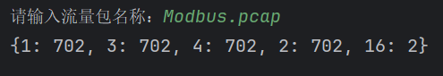

发现16异常少, 所以我们直接去筛选16, **modbus.func_code==16**

发现第一个流的内容就是答案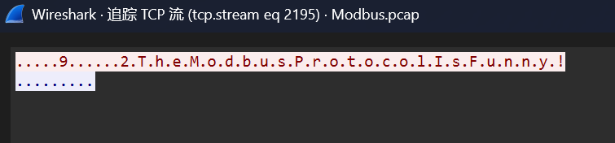

答案即为`TheModbusProtocolIsFunny!`


#### 2.HNGK-modbus协议分析(n)

我们依旧用脚本先读各功能码的次数, 发现有2,3,4,16, 其中16最少, 但我们查看16和2后发现没什么东西, 所以我们接着看3和4, 然后再追踪tcp流后我们发现,3和4在读数据时, 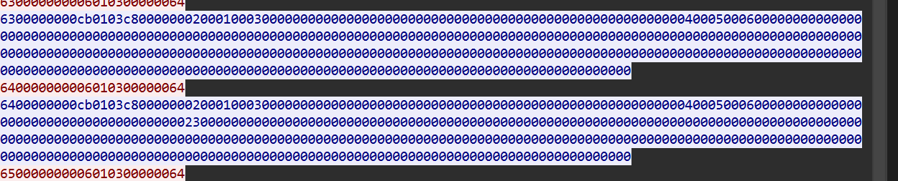

有000包裹的一堆数据里正在慢慢写入内容, 先写入了23, 最后的数据为***0023003d0024004000250026002400260023003d00210021002500210021001f0024001f002100200022003d0024002600240021002200220023001f0021001e00220040002400400021002700250020002400240023001f***

不难发现, 这其实是16进制数据,所以我们将其转换成10进制

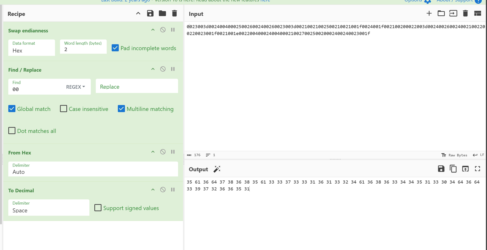

然后再两次from hex和一次base64, 得到`flag{5kbap442ok}`


#### 3.HNGK-modbus异常流量

要求寻找异常流量, 对于这种题,我们的思路是, 去逐一看不同功能码的内容, 然后逐一筛选掉正常流量, 最后的payload是((modbus.func_code==1) && !(modbus.bit_cnt == 8)) && !(modbus.byte_cnt == 1)

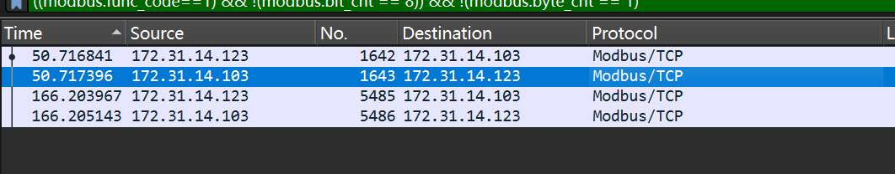

最后得到这两个都是异常流量（Byte length和实际data长度不符）


#### 4.和1是同一道题


## 二.mms

> 制造报文规范

### 知识储备

invokeID:调用者ID，作为数据包唯一标识存在

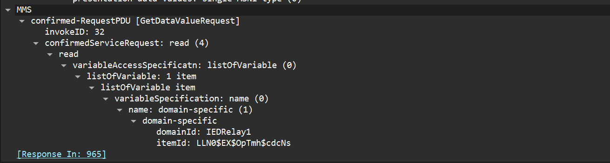

常见四种包体

1. initiate-RequestPDU(启动-请求PDU)
2. confirmed-RequestPDU(确认-请求PDU）
3. nitiate-ResponsePDU（启动-应答PDU)
4. confirmed-ResponsePDU（确认-应答PDU）

### 实战演练

#### 1.HNGK-MMS

筛选mms后发现只有confirmed-RequestPDU和confirmed-ResponsePDU两种包体, 题目让我们找异常流量, 那我们先不选中正常流量, 

((mms) && !(mms.objectName_domain_specific_itemId contains "LLN0")) && !(_ws.col.info == "GetDataValueResponse success")

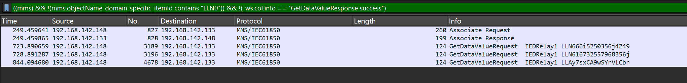

然后发现了三组异常流量, LLN666i5250356j4249和LLN616732557968356j, 去掉LLN后, 发现66对于f, 6167对于lg的ASCII码, 所以我们猜测6i应该是6c, 那6j就应该前移6位为6d, 所以解码得到flRP5mBIag2Uyh5m, 

```
flRP5mBI
ag2Uyh5m
```

每组依次读两个字符组合, 得到flag{RP2U5myhBI5m}


#### 2.HNGK-流量分析1

拿到流量我们直接筛选**flag.** 发现有许多流包含flag.txt, 然后我们找到了1771这条为confirmed-RequestPDU, 并且是fileopen(72)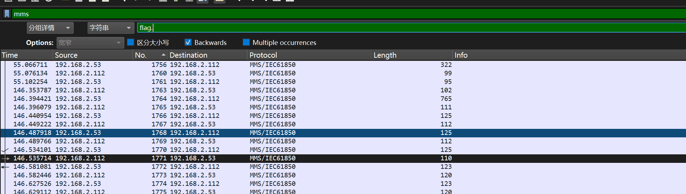

代表它记录了打开flag.txt这个文件的操作, 接下来73,74,75, 可能会有read, write, close操作, 然后我们通过(mms) && (mms.confirmedServiceRequest == ), 依次筛选, 发现73是read, 74是close, 所以我们要在1771后,close前找read操作, 发现1802有close, 1801有read, 所以我们通过invokeID去找1800的响应包, 发现搜索无果, 那我们直接去找1801的流`frame.number== 1801`

然后发现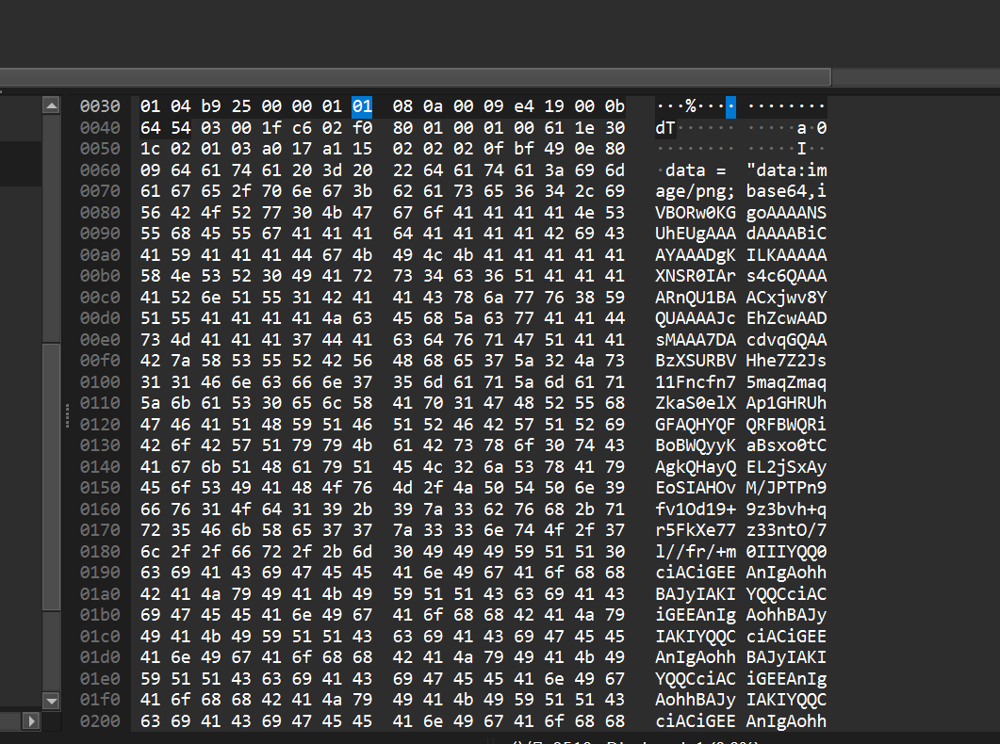

所以应该是base64编码图片

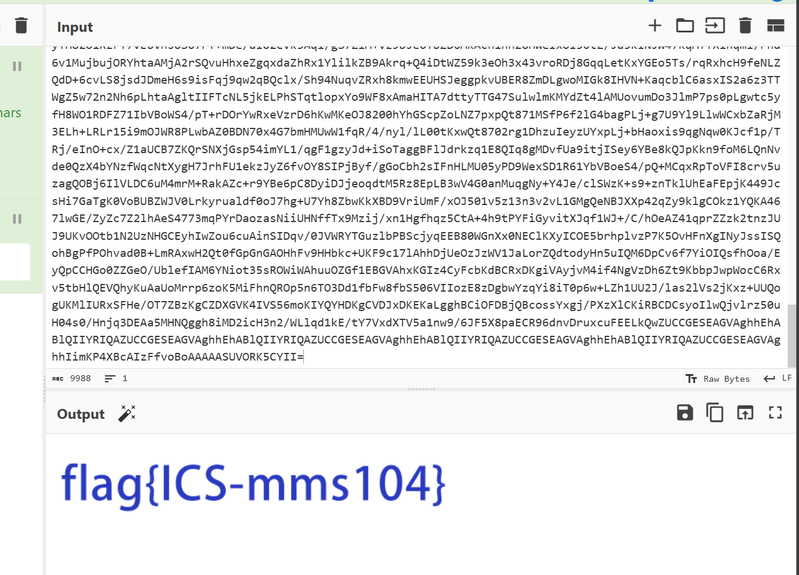

得到flag{ICS-mms104}


## 三.iec60870

> 筛选iec60870_asdu 关注IOA的值 可尝试用type进行分类

### 知识储备

IEC 101（任务相关）
IEC 102（电量相关）
IEC 103（保护相关）
IEC 104（101的网络版）
IEC ASDU（基于101/104的应用服务数据单元传输）

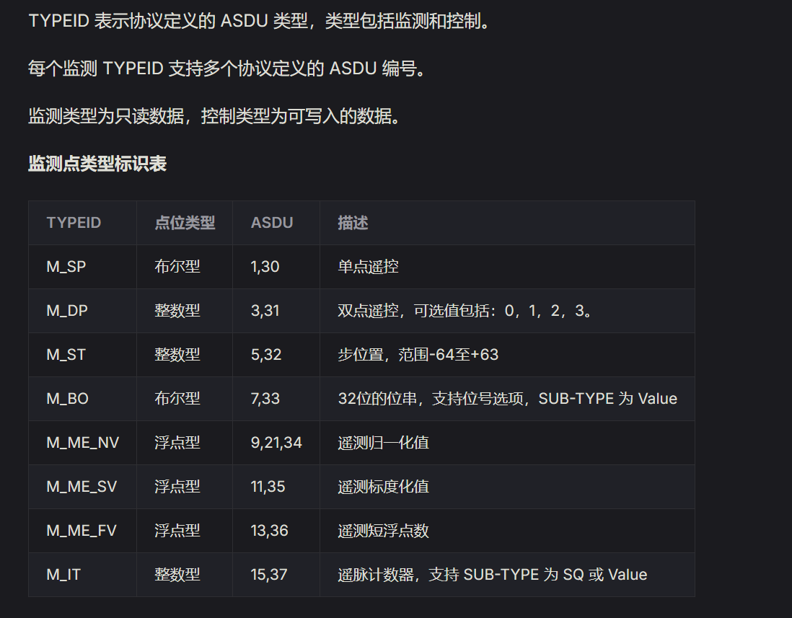

### 实战演练

#### 1.HNGK-IEC协议分析

直接筛选iec60870_asdu, 发现了大量冒红的数据包, 所以我们iec60870_asdu && iec60870_asdu.normval, 然后去分析流量, 发现typeid为9和34的都无规律, 于是有了过滤器

`(((iec60870_asdu && iec60870_asdu.normval) && !(iec60870_asdu.typeid == 9)) && !(iec60870_asdu.typeid == 34)) && !(iec60870_asdu.normval == 0)`

然后提取剩余流ioa的value, 发现每个ioa都有三个包, 所以我们加一层筛选,

`((((iec60870_asdu && iec60870_asdu.normval) && !(iec60870_asdu.typeid == 9)) && !(iec60870_asdu.typeid == 34)) && !(iec60870_asdu.normval == 0)) && (ip.dst == 192.168.161.2)`

然后发现第一个流mZ, 很有可能其实是Zm, 所以我们选择用大端序排序, 用脚本导出value

```python
import pyshark
import re
from Crypto.Util.number import long_to_bytes
import base64

cap = pyshark.FileCapture(
    'IEC104.pcapng',
    display_filter="iec60870_asdu && tcp.stream == 0 && iec60870_asdu.normval && iec60870_asdu.typeid != 34 && iec60870_asdu.typeid != 9",
    tshark_path="D:\\Ctf_Tools\\web\\Wireshark\\tshark.exe",
)

flag_base = ""
for pkt in cap:
    # 使用正则提取 Value 括号内的整数
    match = re.search(r'Value: [0-9.]+? \(([0-9]+?)\)', str(pkt.iec60870_asdu))
    if not match:
        continue          # 如果没有匹配到，跳过该包
    val = int(match.group(1))
    if val == 0:
        flag_base = ""    # 遇到 0 时重置累积字符串（与原始逻辑一致）
        continue
    # 将整数转换为字节（大端序），再解码为 ASCII 字符串
    flag_base += long_to_bytes(val).decode()

print(base64.b64decode(flag_base))
```

得到flag{J92SWGZ6wXIYgQCA}


#### 2.HNGK-奇怪的工控协议

先筛选iec60870_asdu分析, 发现ioa=16385的value对应f, 16386对应l,所以我们只要ioa为16xxx这些包, 经观察发现, 这些包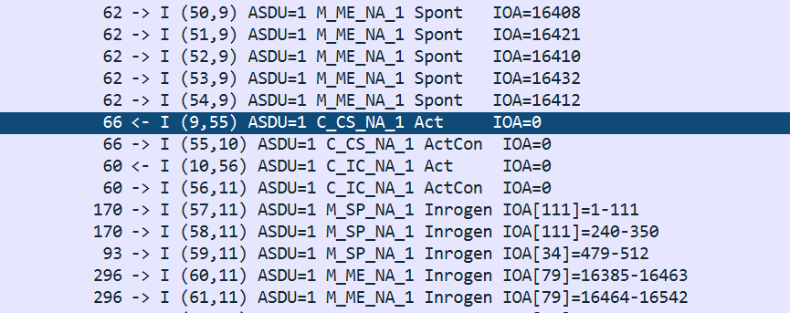

都有..00 0011 = CauseTx: Spont (3)，所以他们的的CauseTx都是Spont

ps：**`CauseTx`（传输原因）是 ASDU（应用服务数据单元）中的一个关键字段**。它用一个数字代码来说明**这条报文被发送或请求的原因**，也就是这条信息的“目的”是什么

所以我们的筛选器为`(iec60870_asdu) && (iec60870_asdu.causetx == 3)`

然后改下脚本, 按ioa排序

```python
#提取value并按ioa的大小排序，并且将value ASCII解码后，舍弃00
from Crypto.Util.number import long_to_bytes
import pyshark
import re

cap = pyshark.FileCapture(
    '104-3.pcapng',
    display_filter="(iec60870_asdu) && (iec60870_asdu.causetx == 3)",
    tshark_path="D:\\Ctf_Tools\\web\\Wireshark\\tshark.exe",
)

data = []  # 用于存储 (IOA, 整数值) 的列表

for pkt in cap:
    # 获取 IOA
    try:
        ioa = int(pkt.iec60870_asdu.ioa)
    except (AttributeError, ValueError):
        continue

    # 只处理 IOA 在 16385~16399 之间的包
    if not (16385 <= ioa <= 16399):
        continue

    # 提取 Value 括号内的整数
    match = re.search(r'Value: [0-9.]+? \(([0-9]+?)\)', str(pkt.iec60870_asdu))
    if not match:
        continue
    val = int(match.group(1))

    # 如果需要跳过值为 0 的包，取消下一行注释
    # if val == 0:
    #     continue

    data.append((ioa, val))

cap.close()

# 按 IOA 排序
data.sort(key=lambda x: x[0])

# 转换并过滤空字符
result = ''
for ioa, val in data:
    try:
        # 转换为大端序 2 字节
        bytes_val = long_to_bytes(val)
        # 解码为 ASCII 并移除所有空字符
        chars = bytes_val.decode('ascii', errors='ignore').replace('\x00', '')
        result += chars
    except OverflowError:
        continue

print(result)
```

得到答案flag{sort__104}


## 四.mqtt

> 是一种基于发布/订阅（Publish/Subscribe）模式的轻量级通讯协议，该协议构建于TCP/IP协议上

### 知识储备

#### 核心控制报文

| 报文类型   | 类型值 | 流向          | 核心作用                      |
| ---------- | ------ | ------------- | ----------------------------- |
| CONNECT    | 1      | 客户端→服务端 | 客户端请求连接 Broker         |
| CONNACK    | 2      | 服务端→客户端 | 连接确认（返回成功 / 失败码） |
| PUBLISH    | 3      | 双向          | 发布消息（核心业务流量）      |
| PUBACK     | 4      | 双向          | QoS1 级消息确认               |
| SUBSCRIBE  | 8      | 客户端→服务端 | 订阅主题                      |
| SUBACK     | 9      | 服务端→客户端 | 订阅确认（返回授予的 QoS）    |
| PINGREQ    | 12     | 客户端→服务端 | 心跳请求（保活连接）          |
| PINGRESP   | 13     | 服务端→客户端 | 心跳响应                      |
| DISCONNECT | 14     | 客户端→服务端 | 主动断开连接                  |

#### 关键机制

**QoS 等级**：0（最多一次，无确认）、1（至少一次，PUBACK 确认）、2（仅一次，四次握手），不同 QoS 的流量交互流程差异大；

**心跳保活**：客户端设置 Keep Alive 时间，无业务流量时发送 PINGREQ/PINGRESP，服务端 1.5 倍超时则断开；

**遗愿（Will）**：客户端异常掉线时，Broker 替其发布遗愿消息，流量中会体现 Will Topic/Message 字段。

#### 重点对象

1.PUBLISH 报文的「负荷（Payload）」字段

未加密的 MQTT（1883 端口）：Payload 直接显示明文，可直接复制查看；

加密的 MQTTs（8883 端口）：需解密后才能看到；

注意 Payload 的编码格式（如 JSON、二进制、纯文本），JSON 格式可直接解析键值对（如`{"temp":25.6, "hum":60}`），二进制需结合设备协议文档解读。

2.PUBLISH/SUBSCRIBE 报文的「Topic Name/Topic Filter」字段

用筛选器mqtt.msgtype == 8, (SUBSCRIBE作用为订阅主题)

| 特征                                 | 是否异常 | 风险等级 | 说明 & 典型例子                                              |
| ------------------------------------ | -------- | -------- | ------------------------------------------------------------ |
| 包含通配符 `#`                       | **异常** | 极高     | 一次性订阅大量消息，典型探测 / 越权例：`/#`、`/device/#`、`#` |
| 包含通配符 `+`                       | **可疑** | 高       | 批量订阅某一类主题，非普通单设备行为例：`+/status`、`sensor/+/data` |
| 以 `$SYS/` 开头                      | **异常** | 极高     | 订阅服务器系统信息，属于探测 / 攻击行为例：`$SYS/broker/connections` |
| 不在业务白名单内                     | **异常** | 高       | 正常设备只会发固定 Topic，陌生主题 = 异常                    |
| 随机字符串 / 乱码                    | **异常** | 中高     | 扫描、爆破、恶意试探例：`x9s7k2`、`a1b2c3`、无意义长串       |
| 主题名极长                           | **异常** | 中       | 可能用于绕过规则、藏数据                                     |
| 含敏感词：admin/root/control/cmd/set | **可疑** | 中高     | 尝试控制、管理类指令主题例：`/admin/set`、`/root/cmd`        |
| 普通设备订阅**控制 / 下发类 Topic**  | **异常** | 极高     | 越权获取控制指令                                             |

| 行为                             | 是否异常 | 风险等级 | 含义                     |
| -------------------------------- | -------- | -------- | ------------------------ |
| 连接后立刻大量订阅               | **异常** | 高       | Topic 扫描、批量嗅探     |
| 反复 SUBSCRIBE / UNSUBSCRIBE     | **异常** | 高       | 试探权限、爆破可用主题   |
| 一个客户端订阅几十上百个 Topic   | **异常** | 极高     | 恶意采集全量消息         |
| 订阅后从不收消息，只扫 Topic     | **异常** | 高       | 典型探测行为             |
| 低权限 ClientID 订阅高权限 Topic | **异常** | 极高     | 越权、未授权访问         |
| 异常往陌生 Topic 大量发消息      | **异常** | 高       | 数据外发、恶意上传、攻击 |

3.PUBLISH/PUBACK/SUBSCRIBE 等报文的「Message ID」字段（仅 QoS1/2 有）

正常流量中，PUBLISH（QoS1）的 Message ID 应和对应的 PUBACK 完全一致；

若看到 DUP=1（重发）的 PUBLISH 且 Message ID 重复，说明该条消息的确认报文丢失，需排查网络。

### 实战演练

#### 1.simple MQTT

打开流量包, 发现流量较少, 看publish信息, 在第13这个流的明文看见了一堆16进制数据, 

**526172211a0701003392b5e50a01050600050101808000597b62d05d02033cb00004a6002073a10fe780030010666c61675f69735f686572652e747874300100030f17f69e4634a29347a81d0d9d379bec15d4c6c6c0dc85da4401b6192e03c639bae9ae8c2120ef8b93160855850a0302aa1f181e4ad8d70197fa95c70fd8084ee40579c7f99a91074ef0a9639880df0411126ed5c146bc11b1984e922c547be3a2fe07ac071651281d77565103050400**

扔cyberchef里, 发现是个rar包, 被加密了, 接着看流量, 发现21的流里有密码

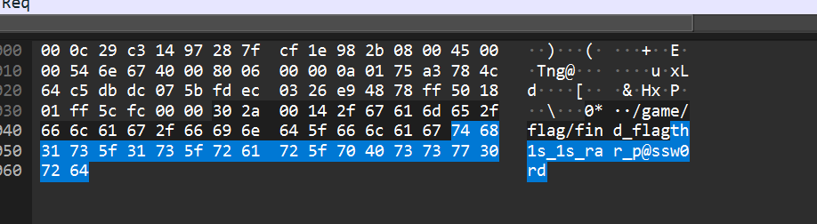

压缩包密码就是th1s_1s_rar_p@ssw0rd

解开后得到一个flag的txt, **flag{46ee7eb02d4c3b504ce79c054464bfd2}**

#### 2.工业物联网智能网关数据分析

先筛选mqtt, 主要也是看publish报文, 所以筛选器`(tcp.stream eq 12 ) && (mqtt.msgtype == 3)` , 然后我们简单看一下各个报文, 在575这个流发现了类似密码的东西, pass_1s_ea4y, 猜测其他报文里应该藏着加密压缩包, 发现各个publish的主题可以凑出f l a g

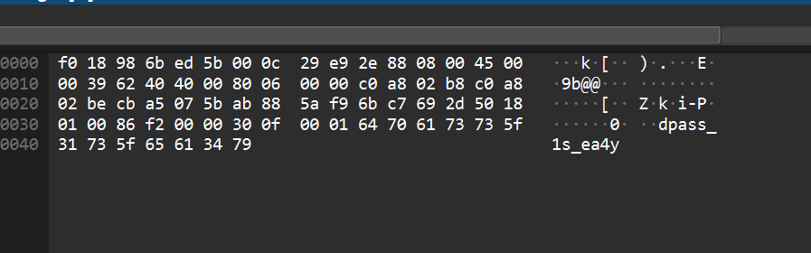

我们拼凑一下, 发现f对应的开头真是504b, 然后得到一个加密压缩包, 密码就是刚刚的pass_1s_ea4y, 然后我们得到了一个二维码, 

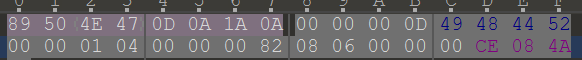

得到png, 猜测宽高是不是被改了, 我们把82改成FF试试,发现下面藏了字符

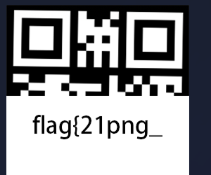

flag{21png_

 然后我们直接binwalk这个flag.png, 发现没东西, 猜测是不是还有别的隐写, 进行多种尝试后发现, 是LSB隐写

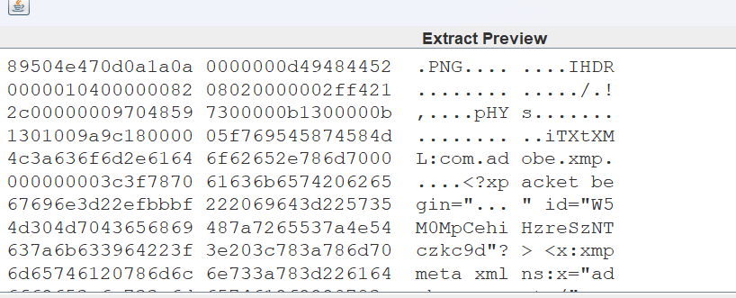

本来想试试用binwalk提取的, 结果windows里显示不了的原始文件, kali直接显示成二维码下半部分的图片了, 所以直接把png部分提取出来, 将两部分二维码组合, 得到完整二维码


扫码得到LSB_is_easy}

得到答案**flag{21png_LSB_is_easy}**


## 五.cotp

> 可以理解为基于TCP的工控TCP

### 知识储备

CR Connect Request (0x0e)——握手，发送方发送

CC Connect Confirm (0x0d)——握手，接收方发送

DT Data (0x0f)——传正常数据

UD User Data (0x04)——少见，传自定义数据

ED Expedited Data (0x01)——少见，传紧急数据

CR和CC只在建立连接时由双方发送，发起方发送CR，被动方发送CC，后续数据主要走DT

### 实战演练

打开包后, 筛选cotp, 发现刚开始没有进行握手, 直接开始传数据, 而黑客需要传流, 必须建立新的握手, 所以我们先按info筛选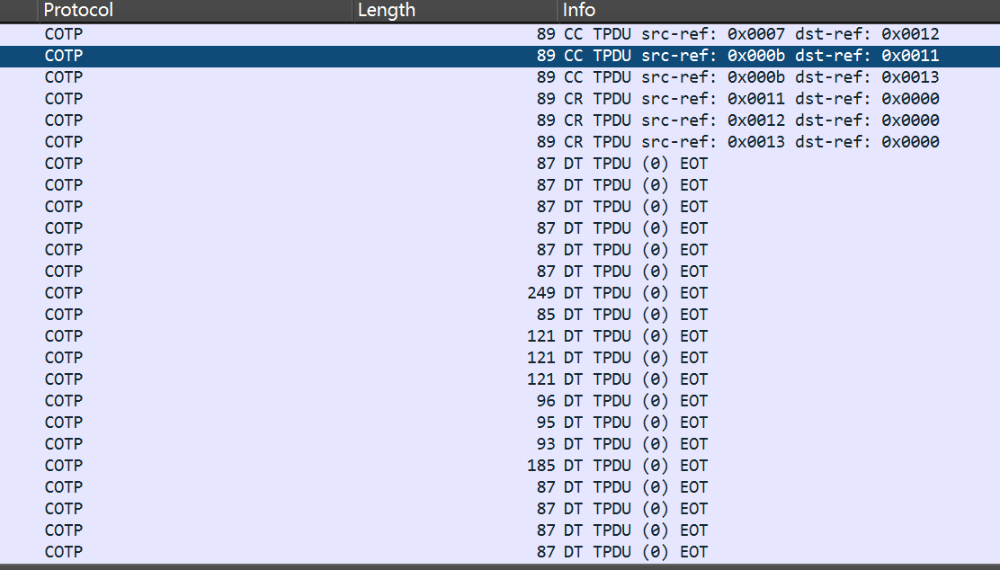

发现总共建立起了三次握手, 所以我们先看最早的一次握手, 215这次, 看到216这个包中有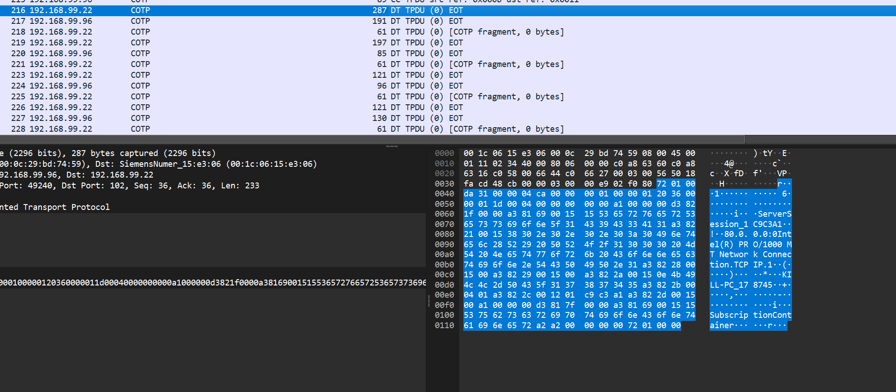

KILL-PC, 所以后面应该是黑客流量, 217就是黑客流量, 取后90字节**31312d31424535312d30584230203b56332e308240001505323b32383882410003000300a20000000072010000**

答案flag{31312d31424535312d30584230203b56332e308240001505323b32383882410003000300a20000000072010000}


## 六.s7comm

> S7comm 协议是西门子 S7 系列 PLC（可编程逻辑控制器）的核心通信协议，主要用于 PLC 与上位机、PLC 之间的数据交互。

### 知识储备

#### 核心功能码

**1.0xF0：建立通信（连接初始化）**

```
请求报文（Job 类型，主设备发送）
响应报文（Ack_Data 类型，PLC 回复）
Header 部分差异：PDU 类型 = 0x03（Ack_Data），错误类 = 0x00（无错误）
```

**2.0x04：读取数据（上位机读取 PLC 数据块）**

```
请求报文（Job 类型）
响应报文（Ack_Data 类型）,返回读取数据
返回码：0xFF = 成功，0x05 = 无效地址（需检查 DB 块是否存在或地址是否超出范围）
```

**3.0x05：写入数据（上位机向 PLC 写入数据）**

```
请求报文（Job 类型）,有写入数据
响应报文（Ack_Data 类型）
返回码 = 0xFF（写入成功）
ps:若返回码 = 0x03（对象不允许访问），需检查 PLC 数据块是否被写保护。
```

### 实战演练

#### 1.被篡改的数据

由题目信息可知, "被篡改", 所以我们关注写入操作, 筛选器

`((s7comm) && (s7comm.param.func == 0x05)) && (s7comm.header.rosctr == 1)`

然后我们发现了大量流, 所以我们考虑用tshark来提取data, 

```bash
"D:\Ctf_Tools\web\Wireshark\tshark.exe" -r "D:\PythonStudy\ctf\流量脚本\流量分析\6.s7comm\被篡改的数据\s702.pcapng" -Y "s7comm && s7comm.param.func==0x05 && s7comm.header.rosctr==1" -T fields -e s7comm.resp.data > hex_data.txt
```

然后得到的txt里面发现了大量66, 我们把66全部替换掉, 然后就在999行找到了新内容

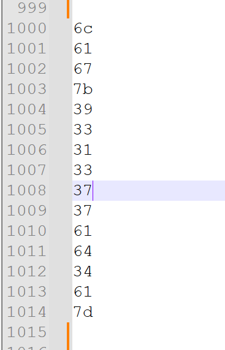

扔到cyberchef里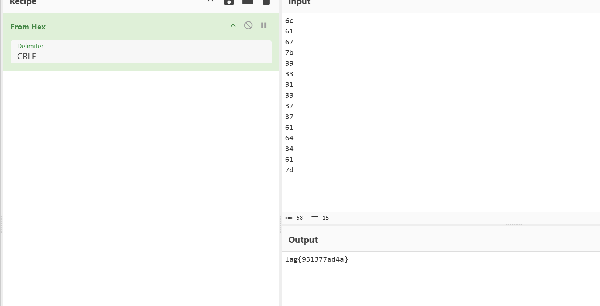

所以最终答案是**flag{931377ad4a}**

#### 2.工控协议分析

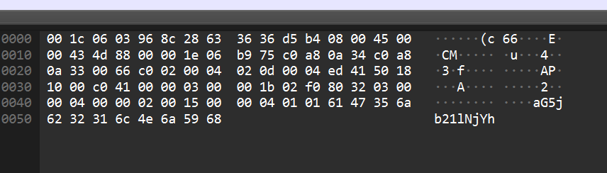

一打开就在第二个包里发现了异常数据aG5jb21lNjYh, 解密后得到hncome66!

**flag{hncome66!}**

#### 3.工控协议数据分析

随便查看几个包, 发现write包里的data有二进制存储的数据, 01100110对应f, 所以我们用tshark提取一下

```bash
"D:\Ctf_Tools\web\Wireshark\tshark.exe" -r "D:\PythonStudy\ctf\流量脚本\流量分析\6.s7comm\工控协议数据分析\s7.pcap" -Y "s7comm && s7comm.param.func==0x05 && s7comm.header.rosctr==1" -T fields -e s7comm.resp.data > hex_data.txt
```

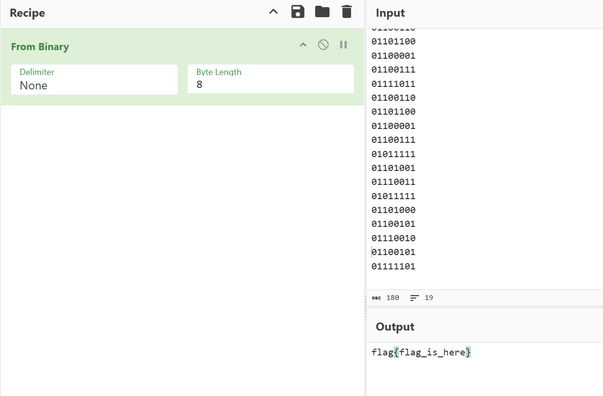

然后就拿到了

**flag{flag_is_here}**

#### 4.协议分析

根据题目说明, 我们要找异常流量, 所以可以把返回码正常的, 筛选掉, `(s7comm) && !(s7comm.data.returncode == 0xff)`

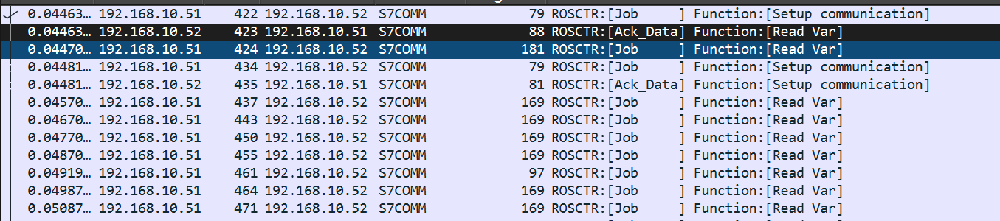

然后我们就看到有个异常的read, 我们看下data

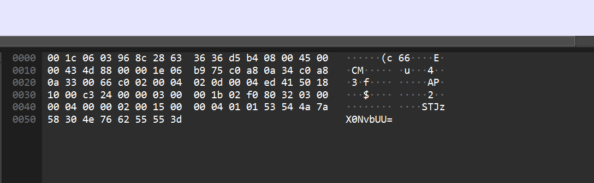

果然发现了base64编码的内容, STJzX0NvbUU=, 解码得到I2s_ComE

**flag{I2s_ComE}**

#### 5.异常流分析

发现流量包很大, 我们先按照题目信息过滤, `((s7comm) && (s7comm.param.func == 0x05)) && (s7comm.header.rosctr == 1)`

发现还是很多, 那我们再用tshark

```bash
"D:\Ctf_Tools\web\Wireshark\tshark.exe" -r "D:\PythonStudy\ctf\流量脚本\流量分析\6.s7comm\异常流分析\eyidata.pcapng" -Y "s7comm && s7comm.param.func==0x05 && s7comm.header.rosctr==1" -T fields -e s7comm.resp.data > hex_data.txt
```

发现数据全是ffff打头, 所以我们把有ffff的筛选掉

`(((s7comm) && (s7comm.param.func == 0x05)) && (s7comm.header.rosctr == 1)) && !(s7comm.resp.data contains ff:ff)`

然后就得到了一个包data为**ffad28a0ce69db34751f**

所以**flag{ffad28a0ce69db34751f}**

## 七.omron

> Omron 流量分析核心围绕**FINS 协议**（Factory Interface Network Service）展开，该协议是欧姆龙专属工控协议

### 知识储备

#### 1.Omron FINS 协议基础认知

> FINS 帧是 Omron 流量分析的核心，**指令帧**和**响应帧**均由**FINS 报头 + 指令域 + 参数 / 数据域**三部分组成，每个字段对应固定字节长度，需精准识别。

**传输方式**：支持**FINS/UDP**（无连接，默认端口 9600，传输快、工控场景主流）和**FINS/TCP**（面向连接，多层网络场景使用），流量分析中 UDP 9600 端口是核心筛选特征。

**通用帧结构（十六进制 / 十进制解析）**

| 字段          | 字节长度 | 核心含义（指令帧 / 响应帧通用） | 关键说明                                                     |
| ------------- | -------- | ------------------------------- | ------------------------------------------------------------ |
| ICF           | 1 字节   | 信息控制域                      | 区分指令帧（0x80）/ 响应帧（0x40）                           |
| RSV           | 1 字节   | 系统保留位                      | 固定为 0x00，无实际含义                                      |
| GCT           | 1 字节   | 网关允许数目                    | 默认为 0x02，最大转发网关数                                  |
| DNA           | 1 字节   | 目的网络号                      | 工控网络一般为 0x00（本地网络）                              |
| DA1           | 1 字节   | 目的节点号                      | PLC / 上位机的 FINS 节点地址                                 |
| DA2           | 1 字节   | 目的单元号                      | 默认为 0x00（CPU 单元）                                      |
| SNA           | 1 字节   | 源网络号                        | 与 DNA 对应，本地网络为 0x00                                 |
| SA1           | 1 字节   | 源节点号                        | 发送设备的 FINS 节点地址                                     |
| SA2           | 1 字节   | 源单元号                        | 默认为 0x00（CPU 单元）                                      |
| SID           | 1 字节   | 服务标识号                      | 指令与响应的 SID 必须一致，用于匹配                          |
| MRC           | 1 字节   | 主指令码                        | 定义操作类型（如 0x01 = 内存读、0x02 = 内存写）              |
| SRC           | 1 字节   | 从指令码                        | 辅助主指令，细化操作（如 0x01 = 读 DM 区）                   |
| 参数 / 数据域 | 可变     | 指令参数 / 响应数据             | 指令帧：存储操作地址 / 长度；响应帧：前 2 字节为错误码，后续为返回数据 |

**ICF**：快速区分指令和响应，0x80 表示上位机发往 PLC 的控制指令，0x40 表示 PLC 的返回响应，流量中二者成对出现。

**MRC+SRC**：组合表示具体操作，是解析流量行为的核心，例如：

- MRC=0x01, SRC=0x01：读取 PLC DM 区数据
- MRC=0x02, SRC=0x01：向 PLC DM 区写入数据
- MRC=0x03, SRC=0x01：读取 PLC 运行状态

**响应帧错误码**：参数 / 数据域前 2 字节**MRES+SRES**，若均为 0x00 表示操作成功；非 0 则为错误（如 0x01 = 地址不存在），可用于分析设备通信故障。

#### 2.Omron FINS 协议 读写类指令码（Command CODE）

| 指令码（MRC+SRC） | 英文名称                  | 中文释义     | 核心用途                                                     | 流量分析重点                                                 |
| ----------------- | ------------------------- | ------------ | ------------------------------------------------------------ | ------------------------------------------------------------ |
| 0x0101            | Memory Area Read          | 内存区读取   | 读取 PLC 核心数据区（DM/CIO/HR 等），**最常用读操作**        | 响应帧的「数据域」是提取关键信息（如 flag）的核心；关注读取的内存区地址和长度 |
| 0x0102            | Memory Area Write         | 内存区写入   | 向 PLC 核心数据区写入数据，**最常用写操作**                  | 正常场景写操作远少于读操作，高频 / 非常规地址写入 = 异常（攻击 / 配置错误） |
| 0x0104            | Multiple Memory Area Read | 多内存区读取 | 一次性读取多个不同类型的内存区（如同时读 DM+CIO 区），简化多地址读取流程 | 数据域包含多个内存区的地址和数据，需拆分解析；CTF 中可能分散存储线索 |
| 0x0105            | Memory Area Transfer      | 内存区传输   | 把一个内存区的数据批量传输到另一个内存区（如 DM→CIO），等效「读 + 写」组合 | 关注源 / 目的内存区地址，异常传输可能篡改关键控制数据        |

| 指令码（MRC+SRC） | 英文名称              | 中文释义       | 核心用途                                              | 流量分析重点                                                 |
| ----------------- | --------------------- | -------------- | ----------------------------------------------------- | ------------------------------------------------------------ |
| 0x0201            | Parameter Area Read   | 参数区读取     | 读取 PLC 系统参数（如通信配置、硬件参数），非业务数据 | 数据多为 PLC 配置信息，CTF 中极少作为考点；异常读取可能是攻击者侦察设备 |
| 0x0202            | Parameter Area Write  | 参数区写入     | 修改 PLC 系统参数，可能导致设备通信异常 / 功能失效    | 流量中出现该指令 = 高风险，几乎是恶意操作（正常场景极少修改系统参数） |
| 0x0220            | Data Link Table Read  | 数据链路表读取 | 读取 PLC 的以太网数据链路配置表（如 FINS 节点映射）   | 仅工业组网场景出现，CTF 中无实际考点，识别即可               |
| 0x0221            | Data Link Table Write | 数据链路表写入 | 修改数据链路配置，可能破坏 PLC 与上位机的通信         | 异常指令，流量中出现需警惕网络攻击                           |
| 0x0306            | Program Area Read     | 程序区读取     | 读取 PLC 内部的梯形图 / 指令程序（二进制格式）        | 数据为加密 / 编码的程序代码，CTF 中极少解析，仅需识别操作类型 |
| 0x0307            | Program Area Write    | 程序区写入     | 向 PLC 写入 / 篡改控制程序，属于最高风险操作          | 流量中出现该指令 = 严重攻击，工控场景中几乎不可能合法出现    |

### 实战演练

#### 1.Fins协议通讯

筛选omron后, 发现有大量包, 因为基本都是read, 所以我们去看response, 筛选器`(omron) && (omron.icf.dtb == 0x01)`

然后我们按length排序, 发现大的包里有大量00, 怀疑00间有包裹数据, 稍微看几个包, 发现

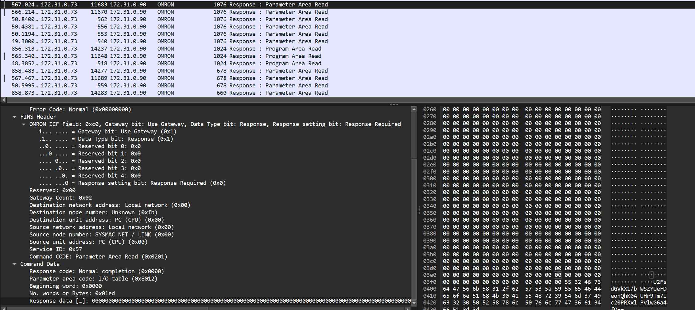

11683这个包里有密文**U2FsdGVkX1/bWSZYUeFDeonQhK0AUHr9Tm7Ic20PRXxlPvlwG6a4fQ==**

U2FsdGVkX1对应的是Salted_ ,所以是OpenSSL AES 密文, 但是没有key, 后来才知道是附件出问题了, 压缩包里应该有注释, 但是没了, 

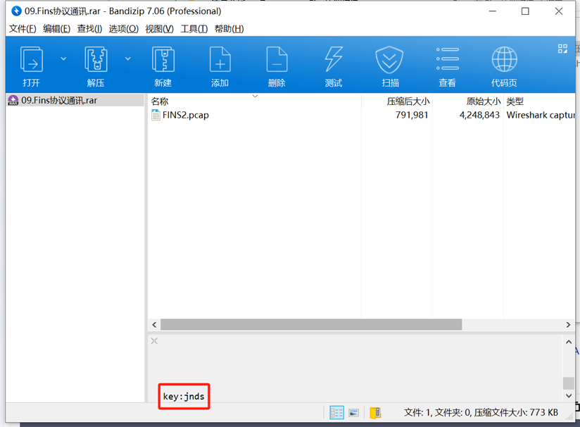

key:jnds

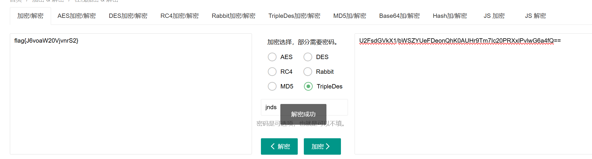

得到答案**flag{J6voaW20VjvnrS2}**

#### 2.Omron Fins

> 题目描述:当通过 OMRON FINS-Tcp 协议向内存写入字符串数据时，会神奇的发现要写入的字符串数据在数据流量包中发生了改变，请根据协议特点分析出原始要写入的字符串数据。flag{string}

经了解

**Omron FINS 协议向 DM 区（内存区代码 82）写入字符串时，DM 区为`Word contents`（字内容）格式，要求**2 字节为一个单位，且每个单位内高低字节互换存储

然后我们看包, 发现就一个write, 里面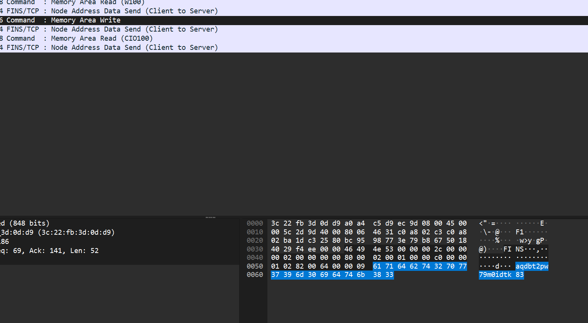

所以数据就是这个, 我们把原始16进制数据保存617164627432707737396d306964746b3833, 然后扔厨子

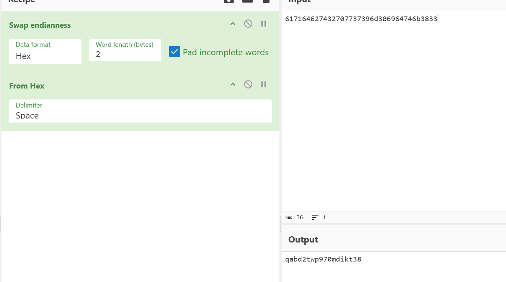

所以答案flag{qabd2twp970mdikt38}

#### 3.异常的Fins协议分析

筛选完omron后, 因为题目是要求找异常数据包, 所以把response筛掉, 然后分析半天无果, 最后发现如果开启TCP检验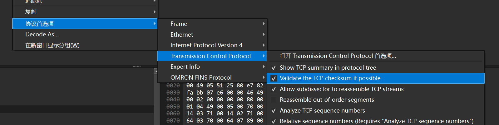

然后筛选器用`_ws.expert.severity == "Error"`, 就可以发现异常数据流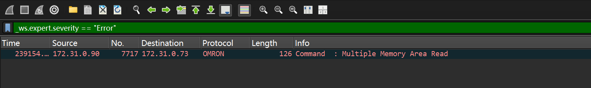

flag{7717}


## 八.隧道

> 识别**利用常规协议封装隐藏数据 / 恶意指令**的异常流量，常见的隧道类型为 DNS、HTTP、ICMP
>
> 工控场景, 可以先把正常流量过滤掉

### 知识储备

#### 1.DNS 隧道分析

DNS 协议本身用于域名解析，正常通信为**短查询、低频率、固定格式**，DNS 隧道则利用**子域名、查询内容、响应数据**封装隐藏数据，是工控 CTF 最经典的隧道考点。

1. 核心异常特征

   - 子域名包含**随机高熵字符**（如`a1b2c3d4.xxx.com`，攻击者将数据编码为子域名）
   - 同一域名的 DNS 查询**频率极高**（远超正常解析需求）
   - DNS 查询 / 响应的**负载数据长度异常**（正常 DNS 负载短，隧道会填充大量数据）
   - 出现非常规的 DNS 记录类型（如 TXT 记录，常被用来传输大段数据）

   

2. Wireshark 过滤规则

   - 过滤所有 DNS 流量：`dns`
   - 过滤 DNS 查询包：`dns.flags.response == 0`
   - 过滤 DNS TXT 记录（重点排查）：`dns.type == 16`
   - 结合工控场景过滤：`dns && !modbus && !s7comm`

   

3. 分析与解码技巧

   - 选中异常 DNS 包，查看**Queries**字段的子域名 / 查询内容，或**Answers**字段的 TXT 记录内容；
   - 提取子域名 / 负载中的字符段，去除域名后缀后，通过**Base64 / 十六进制 / ASCII**解码（工控 CTF 中 Base64 最常用）；
   - 若为分段传输（攻击者将大数据拆分为多个子域名），需按**数据包时间戳**拼接所有字符段后再解码。

#### 2.HTTP 隧道分析

HTTP 协议是工控网络中最常放行的协议，攻击者常利用**HTTP 请求头、请求体、URL 参数、响应体**封装隧道数据，比 DNS 隧道更隐蔽，工控场景中常与工控 Web 管理端结合。

1. 核心异常特征

   - 无实际网页访问的**空请求 / 高频请求**（如频繁向同一 URL 发送 GET/POST，无正常页面响应）
   - 请求头 / URL 参数包含**无意义的编码字符**（如`http://xxx.com/?data=YWJjMTIz`，实际为 Base64 编码）
   - POST 请求的**请求体数据异常**（无正常表单数据，仅为一串编码字符）
   - 响应体为**固定长度的二进制 / 编码数据**（非正常 HTML/JSON 内容）

   

2. Wireshark 过滤规则

   - 过滤所有 HTTP 流量：`http`
   - 过滤 GET 请求：`http.request.method == "GET"`
   - 过滤 POST 请求（重点排查，常传大段数据）：`http.request.method == "POST"`
   - 过滤包含特定参数的请求：`http.request.uri contains "data"`（替换为实际异常参数）

   

3. 分析与解码技巧

   - 选中异常 HTTP 包，右键**Follow → HTTP Stream**，查看完整的请求 / 响应数据流（关键：避免遗漏分段数据）；
   - 提取**URL 参数、Request Body、Response Body**中的可疑字符段；
   - 优先尝试**Base64 解码**，若为二进制数据，可在 Wireshark 中切换**十六进制视图**分析，工控 CTF 中常为 shellcode 或 flag 的十六进制编码。

#### 3.ICMP 隧道分析

ICMP 协议主要用于网络连通性检测（如 ping），正常 ping 包**无负载 / 负载固定**，ICMP 隧道则利用**ICMP 回显请求（echo-request）/ 回显响应（echo-reply）的数据字段**封装隐藏数据，工控场景中常被用来绕过无端口过滤的工控防火墙。

1. 核心异常特征

   - ping 包的**负载数据长度异常**（正常 ping 包负载为 32/64 字节，隧道包可达 MTU 最大值 1500 字节）
   - 同一 IP 间的**ICMP 包高频发送**（远超正常 ping 检测的频率）
   - ICMP 负载包含**非随机的编码 / 二进制数据**（正常 ping 负载为固定字符，隧道为有效数据）

   

2. Wireshark 过滤规则

   - 过滤所有 ICMP 流量：`icmp`
   - 过滤 ICMP 回显请求：`icmp.type == 8`
   - 过滤 ICMP 回显响应：`icmp.type == 0`

   

3. 分析与解码技巧

   - 选中异常 ICMP 包，在 Wireshark**详细信息面板**找到**Data**字段（负载内容）；
   - 若 Data 字段为 ASCII/Base64 编码，直接提取解码；若为二进制，可将二进制转为十六进制后再分析；
   - 若为分段传输，按**时间戳**拼接所有 ICMP 包的 Data 字段，再进行解码（工控 CTF 常考分段拼接）。

### 实战演练

#### 1.DNS

打开流量包筛选dns后, 发现还有大量icmp, icmp没用给它过滤掉`dns && !icmp`,然后发现许多包的dns.ptr.domain_name包含0x开头的内容,我们筛选一下`(dns && !icmp) && (dns.ptr.domain_name contains 0x)`
然后我们用tshark提取一下

```bash
"D:\Ctf_Tools\web\Wireshark\tshark.exe" -r "D:\PythonStudy\ctf\流量脚本\流量分析\8.隧道\DNS\DNS.pcapng" -Y "(dns && !icmp) && (dns.ptr.domain_name contains 0x)" -T fields -e dns.ptr.domain_name > hex_data.txt
```

hex转ASCII后,

```
0x680x580x200x200x200x680x4d0x540x520x390x680x4d0x540x510x31 hX    hMTR9 hMTQ1
0x680x590x570x6b0x780x680x590x570x390x730x680x5a0x530x310x6b hYWkx hYW9s hZS1k
0x680x620x6d0x6c0x6b0x680x620x6d0x630x740x680x4c0x580x6c0x70 hbmlk hbmct hLXlp
0x680x640x570x460x750x680x5a0x690x310x6f0x680x640x570x4e0x30 hdWFu hZi1o hdWN0
0x680x590x570x350x7a0x680x5a0x330x740x6e0x680x5a0x6d0x780x68 hYW5z hZ3tn hZmxh
```

我们发现似乎是4个为一组的base64, 而且由h分割

ZmxhZ3tnYW5z

dWN0Zi1odWFu

LXlpbmctbmlk

ZS1kYW9sYWkx

MTQ1MTR9X

得到**flag{gansuctf-huan-ying-nide-daolai114514}**

#### 2.HMGK-being_hacked

先看协议分级, 发现tcp,icmp,dns都挺多, 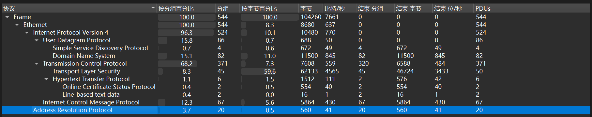

先看dns, 很正常

再看icmp, 然后发现很多包都具有abcd, 所以我们筛选((icmp) && (icmp.type == 0)) && (data.data contains 61:)

然后惊奇发现第一个包的lengh为102,对应f, 所以猜测是length大小隐藏了信息, 我们用tshark提取一下

```bash
"D:\Ctf_Tools\web\Wireshark\tshark.exe" -r "D:\PythonStudy\ctf\流量脚本\流量分析\8.隧道\HMGK-being_hacked\being_hacked.pcapng" -Y "((icmp) && (icmp.type == 0)) && (data.data contains 61:)" -T fields -e data.len > hex_data.txt
```

发现顺序不对fs3cso3lg-33emap2{yia-}-

再研究一下, 发现报文里有一个seq字段,将其添加为列,排序发现正确, 所以我们将length也增为列, 导出为csv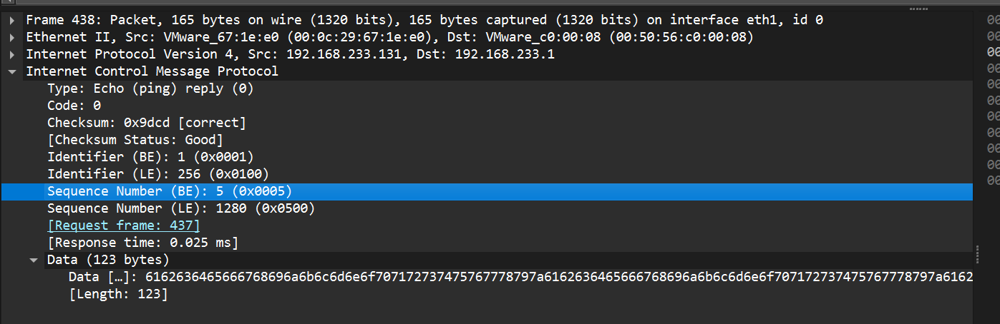

然后将length一列的数值复制出来, 102 108 97 103 123 50 51 51 51 51 45 115 111 45 101 97 115 121 45 105 99 109 112 125 

得到**flag{23333-so-easy-icmp}**

#### 3.icmp

打开包后筛选icmp, 发现还有大量包, 因为有很多没response的流, 所以我们筛选request, 然后我们再把无data的hipercontracer筛掉, 所以筛选器为`((icmp) && (icmp.type == 8)) && !(hipercontracer)`, 然后我们来挖掘各个包的规律, 怀疑在length里藏东西了, 我们tshark提取一下

```bash
"D:\Ctf_Tools\web\Wireshark\tshark.exe" -r "D:\PythonStudy\ctf\流量脚本\流量分析\8.隧道\icmp\fetus_pcap.pcap" -Y "((icmp) && (icmp.type == 8)) && !(hipercontracer)" -T fields -e data.len > hex_data.txt
```

发现有问题, 后来发现原来hipercontracer字段也有data, 所以我们把hipercontracer禁用掉, 就可以正常显示data

```bash
"D:\Ctf_Tools\web\Wireshark\tshark.exe" -r "D:\PythonStudy\ctf\流量脚本\流量分析\8.隧道\icmp\fetus_pcap.pcap" -Y "(icmp) && (icmp.type == 8)" -T fields -e data.len > hex_data.txt
```

得到79 106 112 99 98 109 49 118 98 109 100 118 90 71 73 54 73 84 111 120 78 122 103 48 77 122 111 119 79 106 107 53 79 84 107 53 79 106 99 54 79 106 112 99 98 110 86 105 100 87 53 48 100 84 111 107 78 105 82 77 97 69 104 83 98 50 49 85 82 83 82 78 78 48 77 48 98 106 103 48 86 87 78 71 84 69 70 72 101 51 104 52 77 109 73 52 89 86 56 50 98 87 48 50 78 71 78 102 90 110 78 118 89 50 108 108 100 72 108 57 79 106 111 61 

然后解码获得::\nmongodb:!:17843:0:99999:7:::\nubuntu:$6$LhHRomTE$M7C4n84UcFLAG{xx2b8a_6mm64c_fsociety}::

最后答案FLAG{xx2b8a_6mm64c_fsociety}
